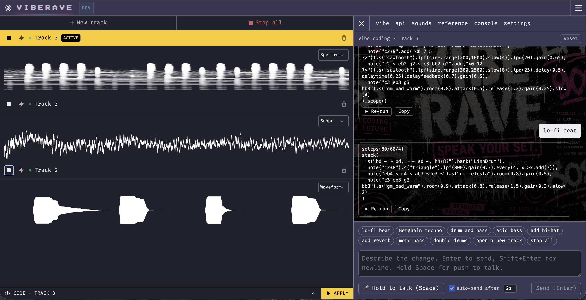

<h1 align="center">VibeRave</h1>

<p align="center">
  
</p>

<p align="center">
  <strong>Vibe-code rave music with your voice.</strong>
</p>

<p align="center">
  Hold a key, speak a command — VibeRave hot-swaps the running pattern<br/>
  in the <a href="https://strudel.cc">Strudel</a> editor without breaking the beat.
</p>

<p align="center">
  <a href="#quickstart">Quickstart</a> ·
  <a href="#backend-matrix">Backends</a> ·
  <a href="#voice-command-reference">Voice commands</a> ·
  <a href="#architecture">Architecture</a> ·
  <a href="LICENSE">License</a>
</p>

<br/>

VibeRave is a fork of [Strudel](https://strudel.cc) that adds a voice-to-code
agent loop. It is fully open source: every backend in the pipeline can be
swapped between **local-only** (offline, free) and **cloud** (faster, more
accurate) implementations — you can run the whole stack with no paid services.

```
       you (in your room or on stage)
            │  "lo-fi beat at 80 bpm, more reverb, swap drums for a 909"
            ▼
   ┌────────────────────────────────────────────────────────────────┐
   │  Voice → Music pipeline                                        │
   │                                                                │
   │   mic → STT  (whisper · vosk · any OpenAI-compat /audio API)   │
   │       → LLM  (any OpenAI-compat chat API · or Ollama)          │
   │       → Strudel code                                           │
   │       → hot-swap into the in-browser scheduler                 │
   └────────────────────────────────────────────────────────────────┘
            │
            ▼  the music keeps playing — your edit lands on the next cycle
```

<br/>

---

<br/>

## Features

- **Hot-swap live coding** — voice commands edit the pattern that's
  currently playing; the audio scheduler keeps the beat across the swap.
- **Pluggable STT** — three speech-to-text backends, switchable per request:
  `whisper` (local), `vosk` (local, sub-15 ms on a closed grammar), or
  `api` (any OpenAI-compatible `/audio/transcriptions` endpoint).
- **Pluggable LLM** — `api` (any OpenAI-compatible Chat Completions endpoint)
  or `ollama` (local, no API key, runs on your laptop). Configure both from
  the in-app **API Settings** panel — no `.env` editing required.
- **Multi-track** — independent tracks with per-track visualizers
  (pianoroll / waveform / spectrum / scope / spiral).
- **Click-to-prompt chips** — 10 canonical commands (`lo-fi beat`,
  `Berghain techno`, `add reverb`, `stop all`, …) above the input. Useful
  when STT is flaky or for first-time visitors who don't know what to say.
- **Per-take metrics + stage dumps** (optional) — every voice take can
  be persisted as `raw.wav` + transcript + JSON metrics so you can
  A/B different STT backends offline.

<br/>

<p align="center">
  
</p>

<br/>

---

<br/>

## Quickstart

> **Goal: from `git clone` to your first voice-driven track in under 5 minutes.**

### 0. Prerequisites

| | Requirement |
|---|---|
| Runtime | **Node ≥ 20.6** &nbsp;·&nbsp; **pnpm ≥ 9** &nbsp;·&nbsp; Chrome / Edge / Firefox 118+ for `getUserMedia` |
| Hardware | A microphone — a USB headset works great; built-in laptop mic is fine for testing |
| Account (pick one) | An API key from any OpenAI-compatible provider (free tiers exist for Groq, OpenAI, OpenRouter, Qwen, Gemini), **or** [Ollama](https://ollama.com/) running locally with a model pulled |

### 1. Clone + install + start

```bash
git clone https://github.com/weijt606/VibeRave.git
cd VibeRave
pnpm install
cp .env.example .env        # leave the placeholders — config happens in-app
pnpm dev
```

You should see two URLs in the terminal:
```
[web]  http://localhost:4321/
[api]  Server listening at http://localhost:4322
```

### 2. Configure your provider in the browser

1. Open <http://localhost:4321/>.
2. Click the **api** tab in the right-hand panel.
3. **Language Model** section → pick a preset chip (OpenAI / Groq / OpenRouter / Qwen / Ollama / Custom), paste your API key.
4. Click **Test LLM** → you should see `✓ <ms> · <model>`. If you see ✗, fix the error before continuing — almost always wrong key, wrong base URL, or wrong model name.
5. **Speech-to-Text** section → leave it on **Whisper** for the first run (zero config, downloads automatically).
6. Click **Test STT** → `✓ <ms> · base.en`.

> Settings persist in your browser's localStorage. They never leave your machine except as headers on requests to your own backend, which forwards them to the chosen provider.

### 3. Talk to it

1. Click the `+` at the top of the left column to create your first track.
2. Hold **Space** anywhere on the page, say *"lo-fi beat at eighty BPM"*, release.
3. The transcript appears in the textarea, auto-sends after 2 seconds, and the editor below fills with Strudel code that starts playing.
4. Holding Space again, say *"more reverb"*. The new pattern hot-swaps on the next cycle.

If you'd rather click than talk, the chip row above the textarea has 10 canonical prompts (`lo-fi beat`, `Berghain techno`, `add reverb`, `stop all`, …) — click one to fill the input.

### Switching STT backends later

The fastest path is the **api** tab; the table below describes when to pick which.

| Backend | Best for | Setup |
|---|---|---|
| **Whisper** (default) | Privacy / offline / no setup | Auto-downloads `base.en` (~150 MB) on first record. Edit `WHISPER_MODEL` in `.env` for `medium.en` / `large-v3-turbo`. |
| **VOSK** | Sub-15 ms latency on the canonical command vocabulary | One-time model download — see "Optional: VOSK setup" below. |
| **API** (OpenAI Whisper / Groq Whisper / self-hosted) | Best free-form accuracy | Pick the preset, paste a key, **Test STT**. |
| **Qwen DashScope native** | DashScope ASR (paraformer / fun-asr) | Native adapter, separate from the OpenAI-compatible path. |

#### Optional: VOSK setup

```bash
cd services/api/models
curl -LO https://alphacephei.com/vosk/models/vosk-model-small-en-us-0.15.zip
unzip vosk-model-small-en-us-0.15.zip && rm vosk-model-small-en-us-0.15.zip
```

Then pick **VOSK (local, ~10ms)** in the api panel. The matched vocabulary
mirrors the prompt-chip list (`DEMO_GRAMMAR` in
`services/api/src/infrastructure/vosk-transcriber.mjs`) — add phrases there
to expand what VOSK will accept.

### Troubleshooting

| Symptom | Likely cause / fix |
|---|---|
| **Test LLM ✗ HTTP 401** | Wrong API key or you pasted into the wrong provider preset. |
| **Test LLM ✗ HTTP 404** | Wrong base URL or model name. Double-check the preset filled the right URL — some providers nest the path (e.g. `/v1` vs `/openai/v1`). |
| **Test STT ✗ HTTP 404 on DashScope** | DashScope's OpenAI-compat shim has no `/audio/transcriptions`. Use the **Qwen (DashScope native)** preset instead of plain Custom. |
| **First voice take takes 5+ seconds** | Whisper's `medium.en` model is downloading or pre-warming. Subsequent takes are ~700-900 ms. |
| **No mic prompt / "Could not start recording"** | Browser blocked microphone access. Click the lock icon in the URL bar → allow Microphone. Reload. |
| **Tracks drift / beats don't align** | Should not happen on `main` — sync is hard-coded on. If you see it, file an issue with browser + Strudel pattern code. |
| **Browser console shows CORS errors** | The web app is not on `localhost:4321` (or wherever the API expects). The API has CORS open by default; check your reverse proxy rewrites if you've fronted it with one. |

---

## Backend matrix

### STT

| `STT_PROVIDER` | Latency (warm) | Accuracy | Where audio runs | Best for |
|---|---|---|---|---|
| `whisper` (default) | 700–900 ms | medium | Local CPU/GPU | Privacy / offline |
| `vosk` | **~10 ms** | high on grammar | Local CPU | Live performance / canonical commands |
| `api` | ~1–2 s | high (free-form) | Your chosen provider | Free-form natural prompts |

The `api` mode targets any endpoint that implements OpenAI's
`/audio/transcriptions` shape — OpenAI Whisper, Groq Whisper, Qwen DashScope's
OpenAI-compatible mode, self-hosted whisper.cpp servers, and so on.

### LLM (code generation)

| `LLM_PROVIDER` | Where it runs | Notes |
|---|---|---|
| `api` (default) | Your chosen provider | Any OpenAI-compatible Chat Completions endpoint |
| `ollama` | Local daemon | Requires `ollama pull <model>` first; verified with `qwen2.5:14b`, `qwen3:8b` |

<br/>

---

<br/>

## Architecture

```
services/api/                          Fastify backend (Node ≥ 20.6, ESM)
  src/
    application/                       Use cases — depend only on ports
      transcribe-audio.mjs             voice → text (any STT backend)
      generate-strudel.mjs             text → Strudel code (any LLM backend)
      validate-strudel.mjs             syntactic guard pre-hot-swap
      transcript-normalizer.mjs        optional LLM cleanup of STT output
      chat-session.mjs                 persisted conversation per session
    domain/                            Pure value objects + errors + WER
    infrastructure/                    Adapters
      whisper-transcriber.mjs          smart-whisper local STT
      vosk-transcriber.mjs             VOSK closed-grammar STT (~10 ms)
      openai-compatible-stt.mjs        any OpenAI-compatible STT API
      openai-compatible-client.mjs     any OpenAI-compatible LLM API
      file-{session,metrics}-store.mjs
      stage-dump-store.mjs
    interface/http/                    Fastify routes
      override-headers.mjs             reads x-llm-* / x-stt-* per request
    skills/strudel/                    composable LLM prompt package

website/                               Astro / React Strudel REPL
  src/repl/
    components/panel/
      VibeTab.jsx                      voice-driven prompt + chat UI
      ApiSettingsTab.jsx               BYO key + base URL UI
    tracks/                            multi-track UI + per-track visualizers
```

The backend follows a clean-architecture layering: HTTP routes call use
cases, use cases depend on **ports** (interfaces in `application/ports.mjs`),
and infrastructure provides adapter implementations. Adding a new STT
backend is one new file in `infrastructure/` plus a branch in
`index.mjs#buildTranscriber`.

---

## Voice command reference

Common phrases the system handles well across all STT backends:

| Category | Examples |
|---|---|
| **Generation** | `lo-fi beat at 80 bpm`, `Berghain techno`, `drum and bass`, `acid bass`, `house at 120` |
| **Drums** | `add hi-hat`, `mute kick`, `double drums`, `more snare` |
| **Effects** | `add reverb`, `more delay`, `make it dubby`, `make it darker` |
| **Stems** | `more bass`, `bring back the lead`, `mute the pad` |
| **Transport** | `play`, `pause`, `stop all`, `open a new track` |

The 10 chips above the input box are also clickable as a deterministic
fallback when speech recognition struggles.

---

## Development

```bash
pnpm dev           # web + api together
pnpm dev:web       # web only
pnpm dev:api       # api only
pnpm test          # vitest
pnpm lint          # eslint
pnpm format-check  # prettier
pnpm build         # production web build
```

`services/api` runs under `node --watch` so source-file edits restart
the server automatically; the web side is Astro's standard HMR.

<br/>

---

<br/>

## Contributing

PRs are welcome. A few conventions to keep things sane:

### How to add a new STT or LLM backend

The whole pipeline is one-file-per-adapter. To add a backend:

1. Create the adapter in `services/api/src/infrastructure/<name>-stt.mjs`
   (or `<name>-client.mjs` for an LLM). It must conform to the
   `Transcriber` / `LlmClient` shape declared in
   `services/api/src/application/ports.mjs`.
2. Wire it into `services/api/src/index.mjs#buildTranscriber` (or
   `buildLlmClient`) plus the per-request `transcriberFor` /
   `llmClientFor` cache.
3. Add a preset to `website/src/settings.mjs` so users can pick it
   from the API tab in one click.

That's it — no plugin system, no registry, no config schema. Each
backend is a small file. See `vosk-transcriber.mjs` and
`dashscope-stt.mjs` for examples that follow non-OpenAI protocols.

### How to extend the voice grammar (VOSK)

VOSK runs in closed-grammar mode. To make a new phrase recognisable:

1. Add it to `DEMO_GRAMMAR` in
   `services/api/src/infrastructure/vosk-transcriber.mjs`.
2. If the phrase contains a word missing from the small-en
   pronunciation lex (Berghain, lo-fi, hi-hat), spell it phonetically
   in the grammar and add a regex to `CANONICALISE` that renames it
   back to the canonical form before the LLM sees it.
3. Optionally add it to the chip row in
   `website/src/repl/components/panel/VibeTab.jsx#PROMPT_CHIPS` so
   users can discover it.

### Pull requests

- Branch off `main`. Keep PRs small and focused — one concern per PR.
- Run `pnpm format-check` and `pnpm lint` before pushing.
- Don't add new dependencies casually. The repo intentionally has a
  small dependency surface; pitch the use case in the PR description.
- For changes to user-visible UI, attach a before / after screenshot
  in the PR description.
- Don't commit anything under `services/api/data/` (PII recordings)
  or `services/api/models/` (multi-GB binaries). Both are gitignored.

### Code style

- ESM throughout. No CommonJS. No mixed `require` + `import`.
- Prefer small files with single responsibility. The clean-architecture
  layering (`application` / `domain` / `infrastructure` / `interface`)
  is intentional — adapter code goes in `infrastructure`, business
  logic goes in `application`, neither touches the other.
- Comments explain *why*, not *what*. Naming should make the *what*
  obvious; comments are reserved for non-obvious constraints, hidden
  invariants, or workaround context.

### Filing issues

Useful repro info:
- **Browser + version + OS** (Chrome 120 / macOS 14, etc.)
- **STT and LLM provider** picked in the API tab
- **The exact phrase you said** + what the chat / textarea ended up showing
- A copy-paste of the relevant `[api]` log line, or the failing request shown in the browser DevTools network tab
- Whether `pnpm test` and `pnpm lint` pass on `main`

<br/>

---

<br/>

## Built on

- [Strudel](https://strudel.cc) — pattern language + audio scheduler (AGPL-3.0).
- [smart-whisper](https://github.com/JacobLinCool/smart-whisper) — Node binding for whisper.cpp (Metal / CUDA accelerated).
- [vosk-koffi](https://github.com/tocha688/vosk-koffi) — modern FFI binding for the [VOSK](https://alphacephei.com/vosk/) toolkit.
- [openai](https://github.com/openai/openai-node) — official Node SDK for OpenAI-compatible HTTP shapes (works against any compatible provider).
- [Ollama](https://ollama.com/) — local LLM runtime (offline alternative, no API key needed).

---

## License

VibeRave is licensed under [**AGPL-3.0-or-later**](LICENSE), inherited from
upstream [Strudel](https://github.com/tidalcycles/strudel) (which is also
AGPL-3.0). Because Strudel is the strongest copyleft license in the
dependency graph, the combined work has to ship under AGPL-3.0.

### Dependency licenses

| Component | License | Compatible |
|---|---|---|
| **Strudel** (in `packages/`) | AGPL-3.0-or-later | inherited |
| **openai** (Node SDK for OpenAI-compatible APIs) | Apache-2.0 | ✓ |
| **smart-whisper** (whisper.cpp binding) | MIT | ✓ |
| **vosk-koffi** (VOSK FFI binding) | MIT | ✓ |
| **wavefile** | MIT | ✓ |
| **fastify** | MIT | ✓ |

All runtime dependencies are MIT/Apache-2.0 (permissive, compatible with
AGPL). External services we *connect to over the network* (OpenAI, Groq,
DashScope, your Ollama instance, etc.) are governed by their own terms —
not bundled, not redistributed, not affected by VibeRave's license.

### What AGPL-3.0 means in practice

Because of the AGPL "network use is distribution" clause, **if you run a
modified version of VibeRave as a public network service, you must make
your modified source available to the users of that service**. Forks for
private use don't have to publish — only public deployments. See the
[full license text](LICENSE).
