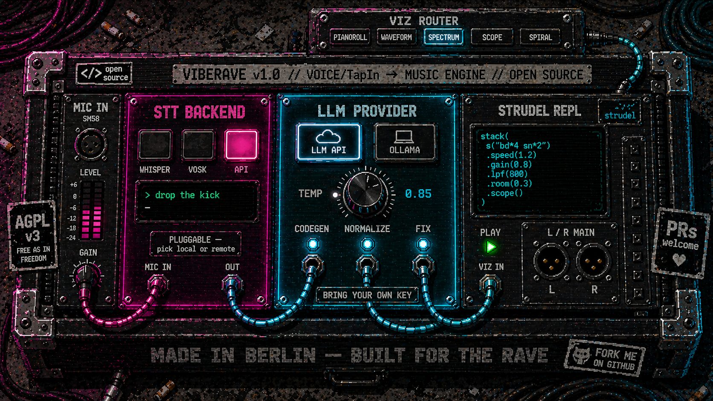
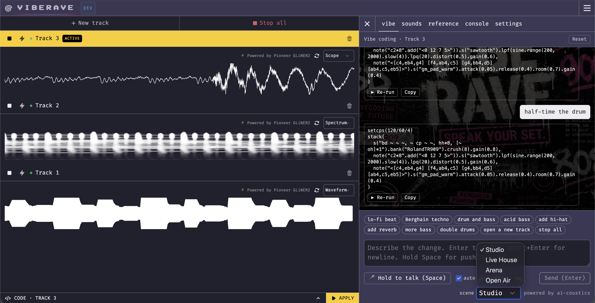

# VibeRave



**Vibe-code rave music with your voice.**
Hold a key, speak a command — VibeRave hot-swaps the running pattern in
the [Strudel](https://strudel.cc) editor without breaking the beat.



```
       you (in your room or on stage)
            │  "lo-fi beat at 80 bpm, more reverb, swap drums for a 909"
            ▼
   ┌────────────────────────────────────────────────────────────────┐
   │  Voice → Music pipeline                                        │
   │                                                                │
   │   mic → STT (whisper / vosk / gemini multimodal)               │
   │       → LLM (gemini / ollama) → Strudel code                   │
   │       → hot-swap into the in-browser scheduler                 │
   └────────────────────────────────────────────────────────────────┘
            │
            ▼  the music keeps playing — your edit lands on the next cycle
```

VibeRave is a fork of Strudel that adds a voice-to-code agent loop. It is
fully open source: every backend in the pipeline can be swapped between
**local-only** (offline, free) and **cloud** (faster, more accurate)
implementations, and you can run the whole stack with no paid services.

---

## Features

- **Hot-swap live coding** — voice commands edit the pattern that's
  currently playing; the audio scheduler keeps the beat across the swap.
- **Pluggable STT** — pick one of three speech-to-text backends per env:
  `whisper` (local), `vosk` (local, sub-15 ms on a closed grammar),
  `gemini` (cloud, best free-form accuracy).
- **Pluggable LLM** — `gemini` (cloud, free tier) or `ollama` (local,
  no API key, runs on your laptop).
- **Multi-track** — independent tracks with per-track visualizers
  (pianoroll / waveform / spectrum / scope / spiral).
- **Click-to-prompt chips** — 10 canonical commands (`lo-fi beat`,
  `Berghain techno`, `add reverb`, `stop all`, …) above the input. Useful
  when STT is flaky or for first-time visitors who don't know what to say.
- **Per-take metrics + stage dumps** (optional) — every voice take can
  be persisted as `raw.wav` + transcript + JSON metrics so you can
  A/B different STT backends offline.

---

## Quickstart

### Requirements

- **Node ≥ 20.6** (the `--env-file` flag the API uses landed in 20.6)
- **pnpm** ≥ 9
- A microphone, a quiet-ish room
- One of:
  - A **Gemini API key** ([free at aistudio.google.com](https://aistudio.google.com/app/apikey)), **or**
  - **Ollama** running locally with a model pulled (e.g. `ollama pull qwen2.5:14b`)

### Install + run

```bash
git clone https://github.com/weijt606/VibeRave.git
cd VibeRave
pnpm install

# Copy the env template and fill in your Gemini API key (or set LLM_PROVIDER=ollama)
cp .env.example .env
$EDITOR .env

pnpm dev
# Web:  http://localhost:4321
# API:  http://localhost:4322
```

The first time you record audio, smart-whisper will download the
`base.en` model (~150 MB) into `services/api/models/whisper/`. To switch
to a larger model edit `WHISPER_MODEL` in `.env`.

### Switching STT backends

```bash
# .env

STT_PROVIDER=whisper   # default — local, no network
STT_PROVIDER=gemini    # cloud, ~1-2s, best free-form accuracy
STT_PROVIDER=vosk      # local, ~10ms, closed-grammar (download model first)
```

For VOSK, download a model and place it in `services/api/models/`:

```bash
cd services/api/models
curl -LO https://alphacephei.com/vosk/models/vosk-model-small-en-us-0.15.zip
unzip vosk-model-small-en-us-0.15.zip && rm vosk-model-small-en-us-0.15.zip
```

The grammar VOSK matches against lives in
`services/api/src/infrastructure/vosk-transcriber.mjs` (`DEMO_GRAMMAR`).
It mirrors the prompt-chip list in the frontend so the click chips and
the recognized vocabulary stay in sync.

---

## Backend matrix

### STT

| `STT_PROVIDER` | Latency (warm) | Accuracy | Where audio runs | Best for |
|---|---|---|---|---|
| `whisper` (default) | 700–900 ms | medium | Local CPU/GPU | Privacy / offline |
| `gemini` | ~2 s | high (free-form) | Google API | Free-form prompts |
| `vosk` | **~10 ms** | high on grammar | Local CPU | Live performance / canonical commands |

### LLM (code generation)

| `LLM_PROVIDER` | Where it runs | Notes |
|---|---|---|
| `gemini` (default) | Google API | Free tier is plenty for development |
| `ollama` | Local daemon | Requires `ollama pull <model>` first; verified with `qwen2.5:14b`, `qwen3:8b` |

---

## Architecture

```
services/api/                    Fastify backend (Node ≥ 20.6, ESM)
  src/
    application/                Use cases — depend only on domain ports
      transcribe-audio.mjs      voice → text (any STT backend)
      generate-strudel.mjs      text → Strudel code (any LLM backend)
      validate-strudel.mjs      syntactic guard pre-hot-swap
      transcript-normalizer.mjs optional LLM cleanup of STT output
      chat-session.mjs          persisted conversation per session
    domain/                     Pure value objects + errors + WER
    infrastructure/             Adapters
      whisper-transcriber.mjs   smart-whisper local STT
      vosk-transcriber.mjs      VOSK closed-grammar STT
      gemini-stt.mjs            Gemini multimodal STT
      gemini-client.mjs         Gemini code-gen
      ollama-client.mjs         Local LLM
      file-{session,metrics}-store.mjs
      stage-dump-store.mjs
    interface/http/             Fastify routes
    skills/strudel/             Composable LLM prompt package

website/                        Astro / React Strudel REPL
  src/repl/
    components/panel/VibeTab.jsx   voice-driven prompt + chat UI
    tracks/                        multi-track UI + per-track visualizers
```

The backend follows a clean-architecture layering: HTTP routes call use
cases, use cases depend on **ports** (interfaces in `application/ports.mjs`),
and infrastructure provides adapter implementations. Adding a new STT
backend is one new file in `infrastructure/` plus two lines in
`index.mjs#buildTranscriber`.

---

## Voice command reference

Common phrases the system handles well across all STT backends:

| Category | Examples |
|---|---|
| **Generation** | `lo-fi beat at 80 bpm`, `Berghain techno`, `drum and bass`, `acid bass`, `house at 120` |
| **Drums** | `add hi-hat`, `mute kick`, `double drums`, `more snare` |
| **Effects** | `add reverb`, `more delay`, `make it dubby`, `make it darker` |
| **Stems** | `more bass`, `bring back the lead`, `mute the pad` |
| **Transport** | `play`, `pause`, `stop all`, `open a new track` |

The 10 chips above the input box are also clickable as a deterministic
fallback when speech recognition struggles.

---

## Development

```bash
pnpm dev           # web + api together
pnpm dev:web       # web only
pnpm dev:api       # api only
pnpm test          # vitest
pnpm lint          # eslint
pnpm format-check  # prettier
pnpm build         # production web build
```

`services/api` runs under `node --watch` so source-file edits restart
the server automatically; the web side is Astro's standard HMR.

---

## Built on

- [Strudel](https://strudel.cc) — pattern language + audio scheduler (AGPL-3.0).
- [smart-whisper](https://github.com/JacobLinCool/smart-whisper) — Node binding for whisper.cpp (Metal / CUDA accelerated).
- [vosk-koffi](https://github.com/tocha688/vosk-koffi) — modern FFI binding for the [VOSK](https://alphacephei.com/vosk/) toolkit.
- [Google Gemini](https://ai.google.dev/) — code generation + optional multimodal STT.
- [Ollama](https://ollama.com/) — local LLM runtime (offline alternative).

---

## License

[AGPL-3.0-or-later](LICENSE) — inherited from upstream Strudel.
