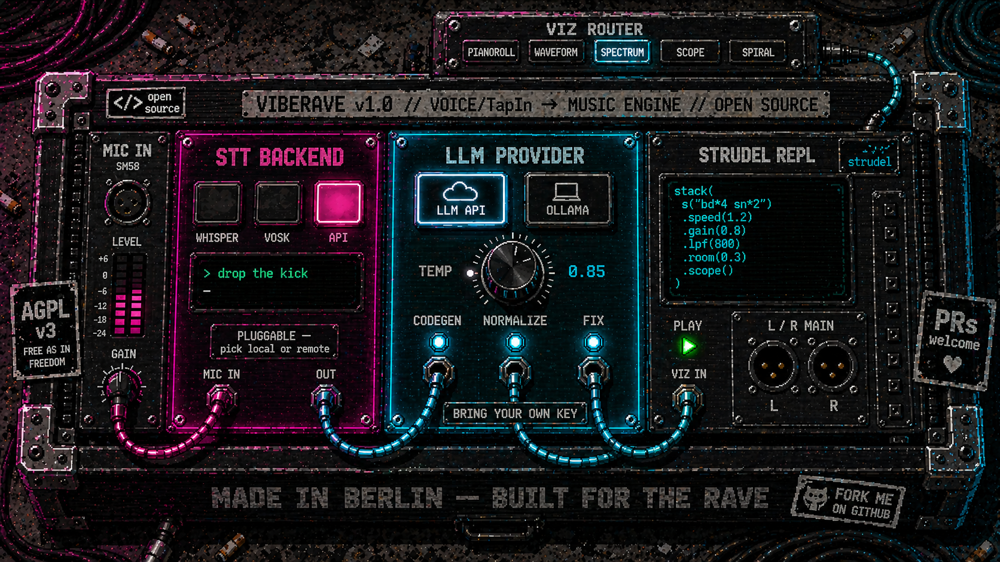

<h1 align="center">VibeRave</h1>

<p align="center">
  
</p>

<p align="center">
  <strong>用嗓子玩 rave —— 说一句、敲一行、点一下都行。</strong>
</p>

<p align="center">
  基于 <a href="https://strudel.cc">Strudel</a> 的多模态实时编码：长按按键说话、回车输入、点选预设标签都接同一个 agent。<br/>
  同一个生成回路，同一个热替换 —— 拍子永不掉。
</p>

<p align="center">
  <a href="#快速上手"></a>
  <a href="#输入方式"></a>
  <a href="#界面指南"></a>
  <a href="#提示词手册"></a>
  <a href="#后端选择"></a>
  <a href="#架构"></a>
  <a href="LICENSE"></a>
</p>

<p align="center">
  <a href="README.md"></a>
  <a href="https://github.com/weijt606/VibeRave/stargazers"></a>
  <a href="https://strudel.cc"></a>
  
  
</p>

<br/>

VibeRave 是 [Strudel](https://strudel.cc) 的一个 fork，在原始 REPL 之上加了一套**多模态 agent 回路** —— 语音、文字、一键预设标签都是平级入口，全部进同一条代码生成管线。完全开源：每一个后端（语音识别 STT、大模型 LLM）都可以在 **本地（离线、免费）** 和 **云（更快、更准）** 之间一键切换 —— 你可以零付费跑完整套。

```
       你（在房间里、或舞台上）
            ├─ 🎙  语音        →  STT (whisper · vosk · 任意 OpenAI 兼容 /audio API)
            │                       │
            ├─ ⌨   打字          ───┤
            │                       ▼
            └─ 🔘  点击预设      →  LLM (任意 OpenAI 兼容 chat API · 或 Ollama)
                                     │
                                     ▼
                              Strudel 代码
                                     │
                                     ▼
                       热替换进浏览器内的循环调度器

            音乐继续放 —— 你的修改在下一个 cycle 落地，不掉拍
```

<br/>

---

<br/>

## 功能特性

- **多模态输入** —— 语音（按住说）、文字（打字）、点击预设三种都是一等公民。同一会话里随便混 —— 语音用来快速生成、打字用来精修、预设标签用来跑高频命令。三种最终汇入同一个 LLM agent 回路。
- **热替换实时编码** —— 每条命令都在改正在播的 pattern；调度器在切换瞬间不丢拍。
- **可插拔 STT** —— 三个语音识别后端，每次请求都能切：`whisper`（本地）、`vosk`（本地，封闭语法下 < 15 ms）、`api`（任意 OpenAI 兼容 `/audio/transcriptions` 端点，包括 Qwen DashScope 的原生 paraformer / fun-asr 路径）。
- **可插拔 LLM** —— `api`（任意 OpenAI 兼容 Chat Completions 端点）或 `ollama`（本地，无需 API key，跑你自己电脑上）。两边都从 **API Settings** 面板配置 —— 不用改 `.env`。
- **多轨** —— 每轨独立可视化（**11 种模式**：钢琴卷帘 / 波形 / 频谱 / 示波器 / 色度 / 6 种 audioMotion 风格柱状 / 螺旋）。所有轨共用一个全局 cycle 时钟，节拍永远对齐。可视化画布**支持鼠标拖拽改高度**（40-480 px），**每轨 RMS 音量条**让你一眼看出哪一轨在响。
- **命令队列** —— 上一条还没生成完时就可以提交下一条；自动排队、按序触发。等待中的可以用 × 取消。
- **点击式预设标签** —— 输入框上方 10 个常用命令。点击只是填进文本框（不会自动发送），你可以编辑后再发。
- **可配置自动发送** —— 语音落地后，**0 秒**直接发（无审阅时间），或 2-10 秒留时间让你打字覆盖。在 api 面板里调。
- **轻量 + 完整两套安装方案** —— 默认 `pnpm install` 只装 VibeRave 本身需要的（约 715 MB）；`pnpm install:full` 加上 Csound、TidalCycles、Gamepad / Motion / MQTT / Serial 输出、Tauri 桌面壳（约 1.1 GB）。一条命令切换。
- **可选的语音录入指标 + 阶段转储** —— 每一次语音录入都可以保存为 `raw.wav` + 转写文本 + JSON 指标，方便离线 A/B 不同的 STT 后端。

<br/>

<p align="center">
  
</p>

<br/>

---

<br/>

## 输入方式

VibeRave 设计上就是**双输入**。哪个顺手用哪个 —— 中途切也行。

| 方式 | 怎么用 | 适用场景 |
|---|---|---|
| 🎙 **语音（按住说话）** | 按住配置好的 PTT 键（默认 <kbd>Space</kbd>）说话，松开自动发 | 现场演出、双手不离设备的工作流、看着舞池说"加点 dub 味" |
| ⌨ **文字（打字）** | 直接在文本框里输入，回车发送 | 精确 prompt（"Berghain techno 132 bpm，bass 加侧链"）、STT 听错时调试、安静环境 |
| 🔘 **预设标签** | 点击文本框上方 10 个 prompt 标签 | 第一次用时探索功能、demo 时秒发常用命令、忘记原话时 |

三种最后都进同一条后端管线。语音先过 STT；文字和预设直接跳过这一步。**LLM 不知道也不在乎到底是哪种方式触发的。**

常见用法是 *语音求快、打字求准*：先用语音说"lo-fi beat at 80 bpm"开一轨，再用打字精确改 *"raise lpf on the bass to 1200, add 1/4-dotted delay on the rhodes"*。

<br/>

---

<br/>

## 快速上手

> **目标：从 `git clone` 到第一首曲子，5 分钟内搞定。**

### 0. 前置条件

| | 要求 |
|---|---|
| 运行环境 | **Node ≥ 20.6** &nbsp;·&nbsp; **pnpm ≥ 9** &nbsp;·&nbsp; Chrome / Edge / Firefox 118+ |
| 磁盘 | 轻量安装（默认）**约 715 MB**，完整安装 **约 1.1 GB**（[安装方案见下](#选择安装方案)） |
| 硬件 | 麦克风 —— 只有想用语音输入才需要。打字输入任何设备都行 |
| 账号（任选其一） | 任意 OpenAI 兼容服务商的 API key（Groq、OpenAI、OpenRouter、Qwen、Gemini 都有免费额度），**或** 本地装好 [Ollama](https://ollama.com/) 并 pull 一个模型 |

### 1. 克隆 + 安装 + 启动

```bash
git clone https://github.com/weijt606/VibeRave.git
cd VibeRave
pnpm install                # 默认：轻量方案（约 715 MB）
cp .env.example .env        # 占位符不用改 —— 配置在网页里做
pnpm dev
```

终端里应该能看到两个地址：
```
[web]  http://localhost:4321/
[api]  Server listening at http://localhost:4322
```

#### 选择安装方案

| 方案 | 命令 | 磁盘 | 包含什么 |
|---|---|---|---|
| 🪶 **轻量** *(默认)* | `pnpm install` | **约 715 MB** | VibeRave 全部需要的：多模态 语音/文字/预设 输入 → LLM → 多轨 Strudel 热替换、11 种可视化、MIDI / OSC 输出、会话持久化 |
| 🎛 **完整** *(完整 Strudel)* | `pnpm install:full` | **约 1.1 GB** | 轻量 + 上游 Strudel 全部包：**Csound** 音频引擎（约 280 MB Closure 编译器）、**TidalCycles** `.tidal` 解析器（约 46 MB tree-sitter-haskell）、**Gamepad / Motion / MQTT / Serial** I/O、**Tauri 桌面壳** |

> **选轻量** 如果你想用 语音/文字/预设 驱动 Strudel 实时编码 —— 这是 VibeRave 95% 的使用场景。**选完整** 如果你要写 `csound("...")` pattern、导入 `.tidal` 文件、用串口控制硬件 MIDI 设备、或把游戏手柄 / 手机陀螺仪接进 pattern。
>
> 切换只要一条命令 —— 不用改代码，不用手动改文件：
> ```bash
> pnpm install:full   # → 切到完整
> pnpm install:lite   # → 切回轻量（释放约 385 MB）
> ```

### 2. 在浏览器里配置服务商

1. 打开 <http://localhost:4321/>。
2. 点右侧面板的 **api** 标签。
3. **Language Model** 区域 → 点一个预设（OpenAI / Groq / OpenRouter / Qwen / Ollama / Custom），粘贴 API key。
4. 点 **Test LLM** → 应该看到 `✓ <ms> · <model>`。如果是 ✗，先修好再继续 —— 99% 是 key 错、URL 错、或模型名错。
5. **Speech-to-Text** 区域 → 第一次跑就用 **Whisper**（零配置，自动下载模型）。
6. 点 **Test STT** → `✓ <ms> · base.en`。

> 配置存在浏览器 localStorage 里。除了作为请求头发到你自己的后端（再由后端转发给所选服务商）之外，绝不离开你的机器。

### 3. 玩起来 —— 语音 / 文字 / 预设

点左栏顶部的 `+` 创建第一轨。然后挑你顺手的输入方式：

**语音**（按住说话）：
1. 在网页任意位置按住 **Space**，说 *"lo-fi beat at eighty BPM"*，松开。
2. 转写文本出现在文本框，约 2 秒后自动发送，编辑器填入 Strudel 代码，音乐开始播。
3. 再按 Space，说 *"more reverb"*。新 pattern 在下一个 cycle 热替换。

> 想零延迟？把 **auto-send after** 调成 0 秒 —— STT 一返回 LLM 就触发。想多留点时间打字覆盖？选 5-10 秒。在文本框里打字会取消等待计时。

**文字**（打字）：
1. 点文本框，输入 *"lo-fi beat at 80 bpm"*，回车。
2. 同一个 agent 回路，跳过 STT 一步。延迟更低、识别完美。

**预设**（一键）：
1. 点文本框上方任一标签（`lo-fi beat`、`Berghain techno`、`add reverb` …）—— 自动填进 prompt。
2. 想编辑就编辑，然后回车或点 **Send**。

> 不知道说什么？直接跳到 [提示词手册](#提示词手册) —— 里面有 lo-fi、Berghain techno、爵士进行、咖啡馆、读书、聚会场景的现成例子。

**演奏中要看的几个地方：**
- **顶部 cycle 指示条** —— 1 px 渐变在右栏顶部从 0% → 100% 滚动一次，对应一个 Strudel cycle。告诉你下一次修改什么时候落地。
- **轨道状态点** —— 青色 + 脉冲 = 在播 · 粉色 = LLM 生成中 · 灰色 = 空闲。
- **每轨音量条** —— 60 × 4 px 深青条显示实时 RMS，一眼看出哪一轨在响（或在静默地坏掉）。
- **代码闪烁** —— LLM 应用新代码时，编辑器里被改的行短暂染青，左侧 3 px diff 槽条同时亮起。打开下方的 **Code** 面板可以看具体改了什么。

**停 / 聚光 / 清空：**
- **单轨停** —— 点该行的 ▶/■ 按钮（其他轨继续播）。
- **聚光** ⚡ —— 把其他轨在 1.5 秒内淡出，只留这一轨。
- **全停** —— 轨道列顶部的按钮（panic stop，所有轨停）。
- **清空** 🗑 —— 一键清空所有轨，会先确认。

### 之后切换 STT 后端

最快的路径是 **api** 标签；下表说明何时选哪个。

| 后端 | 适用 | 配置 |
|---|---|---|
| **Whisper**（默认） | 隐私 / 离线 / 免配置 | 第一次录音时自动下载 `base.en`（约 150 MB）。在 `.env` 里把 `WHISPER_MODEL` 改成 `medium.en` / `large-v3-turbo` 即可换更大模型。 |
| **VOSK** | 封闭命令词表下 < 15 ms 延迟 | 一次性下载模型 —— 见下面"VOSK 可选配置"。 |
| **API**（OpenAI Whisper / Groq Whisper / 自部署） | 自由文本识别最准 | 选预设、粘 key、**Test STT**。 |
| **Qwen DashScope 原生** | DashScope ASR（paraformer / fun-asr） | 原生适配器，与 OpenAI 兼容路径分开。 |

#### VOSK 可选配置

```bash
cd services/api/models
curl -LO https://alphacephei.com/vosk/models/vosk-model-small-en-us-0.15.zip
unzip vosk-model-small-en-us-0.15.zip && rm vosk-model-small-en-us-0.15.zip
```

然后在 api 面板里选 **VOSK (local, ~10ms)**。匹配的词表与 prompt 标签一致（`DEMO_GRAMMAR` 在 `services/api/src/infrastructure/vosk-transcriber.mjs`）—— 想加新短语就改这里。

### 故障排查

| 现象 | 可能原因 / 解决 |
|---|---|
| **Test LLM ✗ HTTP 401** | API key 错或粘到错的服务商预设里了。 |
| **Test LLM ✗ HTTP 404** | base URL 错或模型名错。检查预设是否填了正确 URL —— 有些服务商路径有嵌套（`/v1` vs `/openai/v1`）。 |
| **DashScope 上 Test STT ✗ HTTP 404** | DashScope 的 OpenAI 兼容垫片没有 `/audio/transcriptions`。改用 **Qwen (DashScope native)** 预设，不要用 Custom。 |
| **第一次语音录入要 5+ 秒** | Whisper 的模型在下载或预热中。后续录入约 700-900 ms。 |
| **没弹麦克风权限 / "Could not start recording"** | 浏览器拦了麦克风。点地址栏的锁图标 → 允许麦克风。重载。 |
| **多轨之间漂移 / 拍子对不齐** | 在 main 上不该出现 —— sync 强制开。如果遇到请提 issue，附上浏览器 + Strudel pattern。 |
| **浏览器控制台 CORS 错误** | web 端不在 `localhost:4321`（或 API 期望的位置）。API 默认 CORS 全开；自己加了反向代理的话查代理重写规则。 |
| **`csound("...")` / `.tidal` 导入 / 手柄 / 串口 / MQTT 不工作** | 这些功能只在 **完整** 方案里。`pnpm install:full` 启用。轻量方案下，用了这些包的 pattern 代码不会报错，但调用变成 no-op。 |
| **切完方案后 `pnpm install` 报 workspace 错** | `pnpm install:lite` / `:full` 两个脚本会自动处理。如果你手动复制 YAML 弄错了，跑一次 `pnpm install:lite` 重置到一个已知良好状态。 |

---

## 界面指南

界面分成四个区。如果用过 Strudel REPL，左下两块会很熟悉；右栏面板和多轨 UI 是 VibeRave 特有的。

```
 ┌──────────────────────────────────────────────────────────────────────┐
 │  ◐  VIBERAVE                                                         │  ← 顶栏（只有 logo）
 ├────────────────────────────────────┬─────────────────────────────────┤
 │  + 新轨   ■ 全停   🗑 清空         │  [vibe] [api] [sounds] ...      │  ← 标签页行
 ├────────────────────────────────────┤▒▒▒▒▒▒▒▒▒▒▒▒▒▒▒▒▒▒▒▒▒▒▒▒▒▒▒▒▒▒▒  │  ← cycle 指示条（1 px，每 cycle 滚一次）
 │ ▶ ⚡ ● Track 1 ┃ABC┃ ▮▮▮ 🗑 │ Piano roll ▼  │                         │
 │ ┌──── 可视化画布 ─────┐            │   （拖底边可改高度）            │
 │ │ ▓▓▓▓ ▓▓▓ ▓▓▓▓▓ (每轨独立) │     │                                 │
 │ └────────────────────┘             │     Vibe / API / Settings 面板  │
 │ ▶ ⚡ ● Track 2 ┃ABC┃ ▮▮▮ 🗑 │Scope ▼│                                 │
 │ ┌─── 可视化 ───┐                  │                                 │
 │ │ ~~~~~~~~~~~~~ │                  │                                 │
 │ └──────────────┘                   │                                 │
 ├────────────────────────────────────┤                                 │
 │  </>  CODE · TRACK 1   ▼   ▶ APPLY │                                 │  ← 可折叠代码面板
 │  // 选中轨的 CodeMirror 编辑器                                       │
 └──────────────────────────────────────────────────────────────────────┘
```

### 轨道行

每一轨有自己的一行：

| 元素 | 功能 |
|---|---|
| ▶ / ■ | 播放 / 停止**仅这一轨**（其他轨继续播） |
| ⚡ | **聚光** —— 其他正在播的轨 1.5 秒内淡出，只留这一轨 |
| ● 状态点 | 青色 + 脉冲 = 在播 · 粉色 = LLM 生成中 · 灰色 = 空闲 |
| 名称 | 双击重命名 |
| `ACTIVE` 徽标 | 仅在选中轨显示（黄色警示带行） |
| 音量条 | 60 × 4 px 深青条 —— 实时 RMS |
| 🗑 | 删除这一轨（先确认） |
| 可视化下拉 | 右上角 —— 选这一轨的可视化样式（见下） |

选中轨有**黄色警示带**背景；未选中轨用浅白卡片浮层，避免融进暗色主题里。

### 可视化模式

每轨 11 种模式，全部读同一个 `AnalyserNode`。**拖画布底边**可以改这一行的可视化高度（40-480 px，每轨独立保存）。方形模式不能改高度。

| 模式 | 风格 | 适合 |
|---|---|---|
| **Piano roll** | Strudel 原生卷帘 | 旋律 pattern；纯鼓 loop 显示成单条 |
| **Waveform** | 滚动峰值历史（约 3 秒） | 看时间维度的动态 |
| **Spectrum** | 对数频率谱图 | 时间维度的频率内容 |
| **Scope** *(默认)* | 1024 采样触发示波器 | 看波形 —— 合成器尤其干净 |
| **Chromatic** | 示波器 + 粉青偏移（logo 风） | 品牌风 demo |
| **AM Bars** | 64 条对数频率柱，彩虹渐变 | 经典频谱仪 |
| **AM Octaves** | 24 条更宽的柱，粉→青渐变 | 旋律内容下比 AM Bars 更干净 |
| **AM LED** | 32 柱 × 12 LED 行，Winamp 风 | 复古俱乐部 |
| **AM Mirror** | 中线对称的柱 | 立体声仪表感 |
| **AM Curve** | 96 柱平滑曲线，渐变填充 | 流动连续形状 |
| **AM Radial** | 中心放射 64 道彩色辐线（方形） | 视觉冲击力；要方形槽位 |
| **Spiral** | Strudel 原生圆形 cycle 可视化（方形） | 看循环结构 |

### 顶部 cycle 指示条

右栏顶部 1 px 粉→青渐变条，每个 Strudel cycle 从 0% 滚到 100%，跟全局时钟同步。没轨在播时冻结。在 **Settings → Vibe → Show cycle indicator bar** 切换。

### Vibe 标签（右栏）

默认标签 —— 多模态 prompt 输入 + 聊天历史。

- **按住说话按钮** —— 按住（或按住配置的键，默认 Space）开始录音。边框 + 光晕变青；光晕大小跟你的麦克风电平脉冲。松开发送。在 **Settings → Vibe → Push-to-talk key** 改键。
- **风格选择器（顶行）** —— 12 个青色实心标签，对应最常用的风格（`lo-fi`、`house`、`techno`、`acid`、`drum and bass`、`dub`、`trap`、`IDM`、`ambient`、`jazz chill` 等）。点击切换 —— 支持多选，被选中的风格永远以 `lo-fi + ambient: ...` 形式渲染在 prompt 最前面。
- **编辑标签（第二行）** —— 18 个描边标签，对应常用变形（`add hi-hat`、`more reverb`、`harder kick`、`darker`、`brighter`、`glitch it` 等）。支持多选；选中的标签接在风格之后，逗号分隔。自由打的字会与标签共存。
- **清空（×）按钮** —— 文本框右上角；一键清空 prompt 并取消所有风格 + 编辑标签的选中。
- **自动发送等待** —— PTT 松开后，等这么久再发给 LLM。**0 秒** = 即时（无审阅时间）。2-10 秒留时间让你看转写、用打字覆盖（打字会取消计时）。
- **命令队列** —— 上一条还在生成时也能提交；自动排队按序触发。等待中的可以用 × 取消。
- **代码闪烁** —— LLM 应用新代码时，被改的行短暂染青，左侧 3 px diff 槽条亮起，0.8 秒淡出。

### API Settings 标签

自带 LLM + STT key、base URL、模型。配置存在 `localStorage` 里，作为 `x-llm-*` / `x-stt-*` 请求头发送 —— 服务器永不持久化。STT 区下方的 **Chinese-English mixed input** 复选框启用双语 bias prompt 和 `lang=auto` 转写。详见[后端选择](#后端选择)。

### 与原版 Strudel 的差异

如果你从 strudel.cc 过来，下面是新东西，以及哪些是可选的。

**始终启用（轻量和完整都有）：**
- **多轨** 而不是单一全局编辑器 —— 每轨自己的调度器实例、可视化画布、音量条、代码状态。
- **每轨独立可视化** —— 每轨用自己的 analyser 驱动可视化（11 种模式）；不需要在代码里写 `.scope()` / `.pianoroll()`。
- **Sync 永远开** —— 编辑器层面 `isSyncEnabled = true`，不管设置存的是什么。多轨共用一个 cycle 时钟是硬性要求，不是偏好。
- **行折行永远开** —— 长方法链不会横向溢出。
- **右栏** 承载了多模态 Vibe + API + Sounds + Settings 标签 —— 驱动 LLM agent 回路。底部代码面板是个折叠 CodeMirror 编辑器，只显示当前选中轨。
- **cycle 指示条 + 每轨音量条 + 拖拽可视化** —— Strudel 基础上的实时编码人体工学小细节。

**仅轻量（默认安装）：**
- 跳过上游 Strudel 中 VibeRave 的语音 / LLM 管线不需要的包 —— Csound、TidalCycles 解析器、Gamepad / Motion / MQTT / Serial、Tauri 桌面壳。
- 节省约 385 MB 磁盘 + 约 30 秒安装时间。
- 引用这些包的代码仍能 load —— `loadModules()` 会守护每个可选 import，缺失时静默退化为 no-op。

**需要完整 Strudel 功能集？** 跑 [`pnpm install:full`](#选择安装方案)。所有上游 Strudel 包和 pattern 功能立即可用 —— 不需要其他改动。

---

## 后端选择

### STT

| `STT_PROVIDER` | 延迟（热） | 准确率 | 音频在哪跑 | 适用 |
|---|---|---|---|---|
| `whisper`（默认） | 700-900 ms | 中 | 本地 CPU/GPU | 隐私 / 离线 |
| `vosk` | **约 10 ms** | 词表内高 | 本地 CPU | 现场演出 / 标准命令 |
| `api` | 约 1-2 秒 | 自由文本高 | 你选的服务商 | 自由文本 prompt |

`api` 模式对接任意实现 OpenAI `/audio/transcriptions` 协议的端点 —— OpenAI Whisper、Groq Whisper、Qwen DashScope OpenAI 兼容模式、自部署 whisper.cpp 服务等。

### LLM（代码生成）

| `LLM_PROVIDER` | 在哪跑 | 备注 |
|---|---|---|
| `api`（默认） | 你选的服务商 | 任意 OpenAI 兼容 Chat Completions 端点 |
| `ollama` | 本地守护进程 | 需要先 `ollama pull <model>`；验证过 `qwen2.5:14b`、`qwen3:8b` |

<br/>

---

<br/>

## 架构

```
services/api/                          Fastify 后端（Node ≥ 20.6, ESM）
  src/
    application/                       用例层 —— 只依赖 ports
      transcribe-audio.mjs             语音 → 文本（任意 STT 后端；只在
                                       输入是语音时触发）
      generate-strudel.mjs             文本 → Strudel 代码（任意 LLM 后端；
                                       语音 / 文字 / 预设都进这里）
      validate-strudel.mjs             热替换前的语法守护
      transcript-normalizer.mjs        STT 输出的可选 LLM 清洗
      chat-session.mjs                 会话级别的对话持久化
    domain/                            纯值对象 + 错误 + WER
    infrastructure/                    适配器
      whisper-transcriber.mjs          smart-whisper 本地 STT
      vosk-transcriber.mjs             VOSK 封闭语法 STT（约 10 ms）
      openai-compatible-stt.mjs        任意 OpenAI 兼容 STT API
      openai-compatible-client.mjs     任意 OpenAI 兼容 LLM API
      file-{session,metrics}-store.mjs
      stage-dump-store.mjs
    interface/http/                    Fastify 路由
      override-headers.mjs             读取每请求的 x-llm-* / x-stt-*
    skills/strudel/                    可组合的 LLM 提示词包

website/                               Astro / React Strudel REPL
  src/repl/
    components/panel/
      VibeTab.jsx                      多模态 prompt 输入（语音 + 文字 +
                                       预设）+ 聊天 UI + 命令队列
      ApiSettingsTab.jsx               BYO key + base URL UI
    tracks/                            多轨 UI + 每轨可视化
```

后端是 clean architecture 分层：HTTP 路由调用例、用例只依赖 **ports**（接口定义在 `application/ports.mjs`）、infrastructure 提供适配器实现。加一个新 STT 后端 = 在 `infrastructure/` 里加一个文件 + 在 `index.mjs#buildTranscriber` 里加一个分支。

---

## 提示词手册

什么样的 prompt 出什么样的音乐？VibeRave 是有立场的：驱动 LLM 的 skill prompt 内置了 18 个手工调教的风格模板 + 5 个 level-4/5 的复杂模板（含 eddyflux "coastline" 基准参考）、显式的和弦 / 调式 / FM / vowel 知识、**genre-aware 的 lushness 规则**（trap 默认干、ambient 默认厚）、一个 1–5 级 **complexity dial**（中英文关键词都识别）、以及一份常用变形命令的速查表。把这一节当成菜单。

Vibe 标签编译出的电报上 prompt 格式是：

```
<风格A + 风格B + ...>: <标签A, 标签B, ..., 自由文本>
```

两半都可选 —— `lo-fi` 单独可、`add hi-hat, more reverb` 单独可、`lo-fi + ambient: more reverb, slow it down` 也可。LLM 把风格当作种子流派，右半边当作叠加在上面的修改。

### 词汇一览

| 类别 | 系统能干净处理的短语 |
|---|---|
| **流派 / vibe** | `lo-fi beat at 80 bpm`、`Berghain techno`、`minimal techno`、`house at 120`、`drum and bass at 174`、`acid bass`、`ambient pad`、`dub at 76 bpm`、`trap, half-time`、`IDM broken beats`、`chiptune / 8-bit`、`hyperpop`、`dark drone`、`funky disco`、`jazzy chill at 90` |
| **风格混合** | `lo-fi + ambient`、`dub + minimal techno`、`house + jazz chill`、`acid + IDM` —— 在 12 个风格选择器里挑两个组合出混搭氛围 |
| **鼓** | `add hi-hat`、`mute kick`、`more snare`、`double drums`、`swap drums for a 909 kit`、`swap to LinnDrum`、`harder kick` |
| **效果** | `add reverb`、`more delay`、`make it dubby`、`make it darker`、`more crush`、`add a phaser` |
| **声部 / 合成器** | `more bass`、`deeper bass`、`harder bass`（FM）、`bring back the lead`、`mute the pad`、`add an arp`、`vocal-y filter`（formant） |
| **和声** | `Cm7 to Am7 to Fmaj7`、`play in dorian`、`phrygian feel`、`ii-V-I in C`、`darker / brooding`（小调 + 低 lpf） |
| **能量** | `more energetic`、`more minimal`、`make it faster / slower`、`fast(2)`、`half-time` |
| **质感 / 颗粒度** | `more atmospheric`、`more lush`、`more space`、`warmer`、`vintage feel`（默认就 lush）—— 反向 `grittier`、`rawer`、`drier`、`8-bit`、`chiptune`、`NES-style`、`crush it`（要明确说，默认会避开） |
| **复杂度** | `complex`、`layered`、`rich`、`dense`、`intricate`、`polyphonic`、`polyrhythmic`、`sophisticated`、`maximalist`、`复杂`、`丰富`、`有层次`、`密集`、`立体`、`饱满` —— 推到 level 4-5（嵌套 stack、polyrhythm、voice leading）。反向：`minimal`、`sparse`、`stripped`、`极简`、`简单` |
| **传输控制** | `play`、`pause`、`stop all`、`restart`、`open a new track`、`kill it` |

### 按场景 / 心情

不是每场都要 Berghain。挑一个匹配你所在房间的场景。下面这些 prompt 会引导 LLM 默认偏暖、偏慢、或更氛围 —— 都走 Tier A lushness 规则，让它们呼吸到位。

#### 咖啡 / 咖啡馆（暖、爵士、对话背景）

| Prompt | 你会得到 |
|---|---|
| *"lo-fi hip-hop at 80 with rhodes chords and rain"* | LinnDrum 刷扫鼓 + Rhodes + 锯齿 bass + 小 room |
| *"bossa nova jazz at 110, brushed drums, walking bass"* | `swing(4)`、`gm_acoustic_bass` 走音、`gm_epiano2` 和弦 |
| *"neo-soul groove at 95, 7th chords, gentle swing"* | `Cm9 Fm9 Bb7 Ebmaj7` 配音、软底鼓、爵士 hat |
| *"smooth jazz in dorian at 90, walking bass, gentle pad"* | `chord(...).voicing()` + `gm_acoustic_bass` 走音 + 低 gain `gm_pad_warm` |
| *"city pop at 105, slap bass feel, 80s warmth"* | `gm_electric_bass_finger` + `gm_pad_warm` + `.crush(13)` 磁带感 |
| *"咖啡馆爵士 at 100, vibraphone, walking bass"* | 中文也能用 —— 颤音琴旋律 + 刷扫鼓 + 走音 bass |

#### 读书 / 专注（可预测、低刺激、轻微动态）

| Prompt | 你会得到 |
|---|---|
| *"ambient drone in c minor, slow filter sweep, lots of reverb"* | 单和弦音 + `perlin` LPF + `room(0.95)` |
| *"minimal piano in d minor, slow, sparse"* | `gm_grand_piano` 软起音、`.slow(4)`、无意外变形 |
| *"lo-fi study beat at 75, no surprises, predictable loop"* | LinnDrum 刷扫 + Rhodes + 锯齿 bass，无 `.sometimes()` |
| *"tape-loop ambient in c lydian, slow filter movement"* | `gm_pad_warm` + `.crush(12)` 暖度 + `.lpf(perlin.range(...).slow(32))` |
| *"generative ambient in c phrygian, evolving slowly"* | `irand` 在和弦音中游走、多个慢 LFO |
| *"读书背景音乐, 极简钢琴 in g minor"* | 中文 + 极简关键词 → 单旋律线 + 稀疏左手伴奏 |

#### 聚会（暖、可舞、不要太黑）

| Prompt | 你会得到 |
|---|---|
| *"funky disco at 118 with slap bass and brass stabs"* | `gm_brass_section` + `gm_electric_bass_finger` + 4-on-floor + `.swing(4)` |
| *"nu-disco at 115, side-chain feel, italo-style chord stabs"* | 锯齿 bass + `gm_synth_strings_1` 和弦切击 + 侧链包络 |
| *"deep house at 122 with warm pad and 7th chords"* | `gm_pad_warm` + `chord("<Cm7 Fm7 ...>").voicing()` + 侧链 pad |
| *"afrobeat at 110 with conga, kalimba, electric piano"* | `gm_marimba` / `gm_kalimba` + `gm_epiano2` + 打击律动 |
| *"feel-good house at 120 with vocal-y filter"* | `gm_synth_strings_1` 和弦切击 + `.vowel("<a e i o>")` |
| *"派对放松, funky disco, 120 bpm"* | 中文也行 —— 暖色 disco + 不会太暗 |

#### 氛围 / 电影感（宽、演化、悬时间）

| Prompt | 你会得到 |
|---|---|
| *"dark cinematic ambient in c phrygian with slow filter sweep"* | 锯齿 drone + `perlin.range(200,1200).slow(32)` LPF + `room(0.95)` |
| *"dub techno at 100, deep delays, sparse drums"* | `bd ~ ~ ~` + 重 `delay(0.6).delaytime(0.375).delayfeedback(0.65)` 在和弦上 |
| *"vaporwave at 90, slowed jazz chords, tape warmth"* | `chord(...).voicing()` + `.crush(13)` + `.slow(2)` |
| *"trip-hop at 88, dusty drums, melancholy 7th chords"* | `AkaiMPC60` 碎拍鼓 + 小七和弦进行 + `.crush(13)` |
| *"downtempo cinematic in d minor, breathing pads"* | `gm_choir_aahs` + 慢起音慢释放 + `.lpf(sine.range(...).slow(24))` |
| *"shoegaze pad in g lydian, washed out, layered"* | 失谐 5 振荡 supersaw + `room(0.9)` + `.phaser(2)` |

> **小贴士：** 这四个场景都支持复杂度 dial。在任意 prompt 上加 *"layered"* / *"complex"* / *"丰富"* 推到 level 4-5 —— 例如 *"complex chill bossa with vibraphone, voice-led 9th chords, chunked arpeggio at 100"* 会给你一首编排丰富的咖啡馆曲目。

### 复杂度 dial —— 编排更丰富的曲目

普通流派 prompt 默认 **level 3**（rich：4-5 层、voice leading、polyrhythmic hat）。加上一个复杂度关键词解锁更多。

| 等级 | 你会听到 | 触发词（中英） |
|---|---|---|
| **1** | 1-2 层、单一动态装置、单一和弦 | *minimal、sparse、stripped、raw、naked、极简、简单* |
| **2** | 3-4 层、1-2 个变化装置、2 和弦交替 | *bare、simple、classic-skeleton*（少见 —— 大多数 prompt 都到 ≥ 3）|
| **3** *(默认)* | 4-5 层、polyrhythmic hat、4 和弦进行、对位 bass | （不需要关键词）|
| **4** | 5-6 层、voice-led 扩展和弦、polyrhythm、概率变形、一种 sound-design 手段 | *complex、layered、rich、dense、intricate、polyphonic、polyrhythmic、sophisticated、复杂、丰富、有层次、密集、立体、饱满* |
| **5** | 6+ 层、多段 `arrange()`、polymeter、嵌套 transform、多种 sound-design 手段 | *maximalist、baroque、IDM-density、hyperpop-density、kitchen-sink、极致、满、最大化* |

**关键词与流派叠加**。Level-4 trap 还是 trap（不会自动加 pad）—— 它通过 hi-hat polyrhythm、808 音高变化、对位旋律 stab 层增加密度。Level-4 minimal techno 还是 minimal —— 通过多节奏打击、bass 上慢演化的滤波扫频、ghost 层上的和弦动态来变厚（level 4 允许，因为用户主动要的）。

#### Level 4-5 解锁的技术

不只是"加层数"，level 4-5 解锁简单模板碰不到的编曲技术：

- **嵌套 `stack(...)`** —— 鼓子组里 bank 应用到 4 条打击线，再用一个主 mask 整段开关进出
- **`.late("[0 .01]*4")` 主律动尾** —— 人性化微 swing，给整个混音"成品感"
- **`.mask("<...>/16")` 段落门控** —— 层级在 16 cycle 的宏块里淡入淡出，loop 有宏结构
- **`chord(...).dict('ireal').voicing()`** —— 爵士级扩展配音（9th、11th、sus4），不只是裸三和弦
- **`.set(chords)` 继承式 voice leading** —— bass 自动跟随和弦进行的根音
- **`sine.range(low, high).slow(N)` 连续调制** 同时作用于 `.fm` / `.lpf` / `.gain` —— 三路调制器到三个参数
- **Polymeter** —— 一层 7/8 或 `slow(3)` 对抗 4-cycle 基底，造出"永不真正重复"的相位互动
- **概率 transform** —— `.rarely(ply(2))`、`.chunk(4, fast(2))`、`.degradeBy(0.15)` 增加不可预测性
- **粒子化处理** —— `.segment(4).clip(rand.range(0.4, 0.8))` IDM 风微 loop

#### 能产出 coastline 级丰富度的 prompt

skill 内置了 eddyflux ["coastline"](https://strudel.cc) 作为 level-5 的参考。要逼近那个质量：

| Prompt | 你会得到 |
|---|---|
| *"complex deep house at 122 with rich layers and voice-led 9th chords"* | 嵌套鼓 stack、`chord("<Cm9 Fm11 Bb7sus Ebmaj9>").dict('ireal').voicing()`、polyrhythmic hat、supersaw 和弦 pad、masked 对位旋律 |
| *"layered IDM, polyrhythmic, intricate, chunked breakbeats"* | 碎拍鼓 + `.chunk(4, fast(2)).sometimes(rev)`、bass + `.fmi(sine.range(2,12).slow(11))`、7-对-3-对-5 相位互动 |
| *"dense ambient drone, evolving, breathing, c minor"* | 5 振荡失谐 supersaw drone 床、pad 慢相位、和弦音随机游走、masked sub 脉冲、稀疏空气闪光 |
| *"sophisticated jazz-techno at 130, polyrhythmic, with phaser and chunked arpeggio"* | Coastline 风：和弦词典、segmented arp + FM 调制、粒子 clip、9th 配音 |
| *"复杂的 deep house, 有层次, voice leading"* | 中文等同 —— ZH 关键词触发同样的 level-4 逻辑 |
| *"give me a coastline-style chill house at 70 bpm with 9th chords and chunked arpeggio"* | 直接引用经典示例 —— 应该最接近 eddyflux 输出 |

#### 中途升 / 降复杂度的迭代

已经有东西在播？拨一下 dial：

| 你说 | 改什么 |
|---|---|
| *"make it more complex"* / *"more layers"* / *"加点层次"* | +1 级：加 polyrhythmic 打击、对位旋律、或一路调制 |
| *"add voice leading"* / *"jazzier chords"* | 把裸 `note("[c3,eb3,g3]")` 换成 `chord("<...>").dict('ireal').voicing()` |
| *"add a polyrhythmic hat"* | 插入 `s("hh*16").struct("1 0 1 1 0 1 0 1...")` |
| *"add modulation routing"* | 在现有层上接连续 `sine.range().slow()` 到 filter / FM / gain |
| *"chunked arpeggio"* | 把旋律层包进 `.segment(4).chunk(4, fast(2))` |
| *"sectional gating"* | 加 `.mask("<0 1 1 1>/16")` 让层在 16 小节内进出 |
| *"groove tail"* / *"humanize the timing"* | 在外层 `stack` 末尾接 `.late("[0 .01]*4").late("[0 .01]*2")` |
| *"strip it down"* / *"make it minimal"* / *"简化"* | -1 或 -2 级：删对位旋律、闪光、ghost pad |

### 演奏走查

#### 搭一首 lo-fi 学习曲（3 turn）

| Turn | Prompt | 你听到 |
|---|---|---|
| 1 | *"lo-fi beat at eighty bpm"* | LinnDrum + 锯齿 bass + Rhodes 和弦（C-Am-G-Eb），慢 swing，约 80 BPM |
| 2 | *"add reverb on the rhodes"* | 同 pattern，Rhodes 层加 `room(0.7)`；鼓 + bass 不动 |
| 3 | *"make it sleepier"* | LPF 下来、起音/释放变长、整体微慢 |

#### Berghain → minimal techno → drum and bass（多轨）

| Turn | Prompt | 你听到 |
|---|---|---|
| 1 | *"Berghain techno at one thirty-eight"* | 132 BPM 黑暗 / 催眠 —— 909 底鼓、delay 淹没的 clap、稀疏 hat、sub bass |
| 2 | *"harder bass"* | bass 从锯齿+lpf 切到 FM 合成（`.s("sine").fmh(2).fmi(...)`）—— 金属感、更激进 |
| 3 | *"open a new track. minimal techno"* | 第二轨同步开始 —— 稀疏 130 BPM，只有底鼓 + ticks |
| 4 | *"open a new track. drum and bass at one seventy-four"* | 第三轨 —— 174 BPM 碎拍，Amen 风切片 |
| 5 | *"stop all"* | 三轨在下一个 cycle 整齐停 |

#### 爵士和声探索（和弦 + 调式 prompt）

| Turn | Prompt | 你听到 |
|---|---|---|
| 1 | *"Cm7 to Fm7 to Bb7 to Ebmaj7, dorian, ninety bpm"* | `chord(...).voicing().anchor("c4")` 在 LinnDrum 刷扫 + 走音 acoustic bass 之上 |
| 2 | *"make the chord more dubby"* | 和弦层加 `delay(0.5)` + `delaytime(0.375)` + `delayfeedback(0.6)`；bass 鼓不动 |
| 3 | *"add a walking bass in c minor"* | `gm_acoustic_bass` 音阶走音加进 `stack` |

#### Hyperpop 音色设计

| Turn | Prompt | 你听到 |
|---|---|---|
| 1 | *"hyperpop at one sixty bpm"* | 160 BPM、square 主旋律、triangle bass、F 大调、主输出 `.crush(8)` |
| 2 | *"more crush"* | crush 位深降到 4-5 |
| 3 | *"vocal-y filter on the lead"* | square 主旋律加 `.vowel("<a e i o>")` 循环 |

#### 从零堆复杂度（4 turn）

同一个 prompt，每 turn 拨一档复杂度。适合 demo 时想现场展示密度演化。

| Turn | Prompt | 你听到 |
|---|---|---|
| 1 | *"deep house at 122"* | Level 3 默认 —— 4-5 层、polyrhythmic hat、voice-led 4 和弦进行 |
| 2 | *"make it more complex, add chunked arpeggio"* | 加第 5 层 `chord(...).dict('ireal').voicing()` 配 `.segment(4).chunk(4, fast(2))` 和 `.fm(sine.range(...).slow(8))` 调制 |
| 3 | *"sectional gating, 16-bar mask"* | 把和弦 + 对位旋律包进 `.mask("<0 1 1 1>/16")`，让它们在 loop 内进出而不是每 cycle 重复 |
| 4 | *"groove tail and stereo size"* | 外层 `stack` 末尾接 `.late("[0 .01]*4").late("[0 .01]*2").size(4)` —— 人性化时序 + 更宽立体声，eddyflux "coastline" 收尾笔触 |

到 turn 4 你已经从干净的 4 层 house 走到 level-5 极致编排，把 skill 知道的所有手段都用上了。

#### 风格混合（UI 驱动）

在选择器里点两个风格标签 —— 它们编译进 prompt 成 `<风格A + 风格B>:`。右侧的标签和自由文本叠加在上面。

| 编译后 prompt | 你听到 |
|---|---|
| *`lo-fi + ambient: more reverb`* | lo-fi 慢 swing LinnDrum + Rhodes，但和弦由 `gm_pad_warm` ghost 层（约 0.25 gain、room 0.7）扛 —— 氛围感不丢节拍 |
| *`dub + minimal techno`* | 130 BPM 极简鼓，但和弦切击有 dub 模板的 `delay(0.5).delaytime(0.375).delayfeedback(0.65)` —— 长回声尾配稀疏脉冲 |
| *`house + jazz chill`* | 120 BPM 4-on-floor，但和弦走 ii-V-I + `gm_epiano2` 配音，不再是常规 house 切击 |
| *`acid + IDM`* | 303 风 `.lpf(sine.range(...)).lpq(15)` bass，但鼓 pattern 用碎 `.struct("1 0 1 0 0 1 0 1")`，不是直 4/4 |
| *`techno + ambient: more space`* | 132 BPM 底鼓 + hat 骨架 + 长尾 pad，room(0.85)，大部分非必要层削掉 |

两个流派是种子不是平分 —— LLM 从一个挑节奏骨架，从另一个挑和声 / 氛围特征。结果不对就换顺序或加一个明确的标签（比如 `lo-fi + ambient: more bass` 锚定更 lo-fi）。

### 单句 one-liner

直接丢进文本框（或对着说）就能立刻出结果。

| Prompt | 风格 |
|---|---|
| *"give me a chill lo-fi beat at 80 bpm with rhodes chords"* | Lo-fi hip-hop |
| *"deep house at 120, sidechain on the pad"* | 经典侧链 pad 的 deep house |
| *"Berghain techno at 132 with FM bass"* | 黑暗 / 工业 |
| *"jungle at 174 with amen break and sub bass"* | DnB / jungle |
| *"ambient pad in c minor, slow, lots of reverb"* | Drone / 黑暗氛围 |
| *"acid 303 bassline, lpf swept, lpq high"* | Acid |
| *"trap at 140 half-time, 808 sub, hi-hat rolls"* | Trap |
| *"chiptune in F major at 160 with crush"* | 8-bit（明确指定）|
| *"NES-style boss music in C minor at 150"* | 8-bit（明确）—— 裸 square + triangle、硬 `.crush(8)` |
| *"raw, gritty 8-bit punk in F at 170, no reverb"* | 8-bit（明确）—— 不要任何氛围 |
| *"phrygian techno at 138, minor feel"* | 调式 techno |
| *"jazz progression Cm7-Am7-Fmaj7-G7 with walking bass at 90"* | 调式 jazz |
| *"lush deep house at 122 with warm pad and side-chain"* | 氛围 / lush —— supersaw pad、gm_pad_warm、完整侧链 |
| *"vintage warm techno at 132, tape feel, gentle saturation"* | 复古 —— `.crush(13)` + `.shape(0.3)`，无刺耳混叠 |
| *"smooth ambient drone in c minor, deep reverb, slow filter sweep"* | 极致氛围 —— 单一扫频、`room(0.9)` |

### 迭代命令（已经在播时）

LLM **总能看到当前 pattern**（在 `<current>` 块里），所以迭代会保留你没要求改的部分。

| 你说 | 改什么 | 保留什么 |
|---|---|---|
| *"more reverb"* | 主旋律层加 `room(0.7-0.9)` | 鼓、底鼓、结构 |
| *"make it dubby"* | 非鼓层加 `delay` / `delaytime` / `delayfeedback` | 速度、kit、旋律 |
| *"swap to RolandTR808"* | 鼓线换 `.bank("RolandTR808")` | 旋律、结构、速度 |
| *"darker"* | LPF 下、room 上、soundfont 换暗的 | 节奏、和声 |
| *"harder bass"* | 换 `.s("sine").fmh(2).fmi(...)`（FM 合成）| 鼓、旋律 |
| *"vocal-y filter"* | lead/synth 加 `.vowel("<a e i o>")` | 鼓、bass、和声 |
| *"every 4 bars flip the hihats"* | hh 层加 `.every(4, rev)` | 其他全部 |
| *"quieter overall"* | 外层 `.gain(0.6)` 或逐层降 gain | 结构 |
| *"more energetic"* | 某处 `.fast(2)`、可选加 `hh*16` 层 | 核心想法 |
| *"more atmospheric / more lush"* | 加 reverb 尾（`.room(0.7)`）+ 缺 pad 时补软起音 pad | 速度、kit、结构 |
| *"warmer / vintage"* | `.crush(12-14)` + `.shape(0.3)` 饱和；裸锯齿换失谐 supersaw 堆 | 节奏、和声 |
| *"more 8-bit / chiptune-y"* | 硬 `.crush(8)`、单声道居中、去掉 reverb/delay、把 gm 替换成裸 square/triangle | 速度、结构 |
| *"drier / rawer"* | 去掉 reverb + delay 尾、收紧起音 | 节奏、kit |
| *"strip everything except drums and bass"* | 删掉 stack 里的和弦/pad/lead | 鼓、bass |

### 系统会礼貌拒绝的请求

LLM 被告知不要瞎编 —— 当请求无法转成 pattern 时，它返回一个 "Couldn't generate" 标记，编辑器保持不变。触发条件：

- 跑题（"给我写首诗"、"今天天气如何"）
- skill 不认识的流派 / 乐器（非常冷门的地区性风格）
- 需要 Strudel 已验证 API 之外的代码

### 小贴士

- **语音最快** —— 适合短的标准命令（`"more reverb"`、`"stop all"`）。
- **打字最准** —— 适合 LLM 可能听错的精修：*"raise lpf to 1200 on the bass layer"* 打字比说更安全。
- **预设是入口** —— 点风格 + 编辑标签，可选编辑编译后的 prompt，再发。多选可切换，再点一次同一个标签即取消。
- **现代电子默认** —— lushness + sound-design 规则把通用 prompt 引导远离裸锯齿、单声道、`.crush(8)`。如果你**真的**要 chiptune，就明确说出来（`"8-bit"`、`"chiptune"`、`"NES-style"`、`"crush it"`）—— 这些关键词会关掉默认规则。
- **多轨自动同步** —— 一个全局 cycle 时钟，随时开新轨不打扰其他轨。

文本框上方：12 个青色风格标签（多选）在上、18 个描边编辑标签（多选）在下 —— 编译成 `<风格>: <标签, 自由文本>` 后发送。文本框上的 × 一键清空一切。驱动 LLM 的 skill 提示词在 `services/api/src/skills/strudel/`（rules、reference、recipes、examples）—— 在那里加新流派模板、变形配方、音色规则，下次 `/generate` 调用 LLM 就能用上（不需要重启；skill 文件每次请求都重读）。

---

## 开发

```bash
pnpm dev           # web + api 同时
pnpm dev:web       # 只 web
pnpm dev:api       # 只 api
pnpm test          # vitest
pnpm lint          # eslint
pnpm format-check  # prettier
pnpm build         # 生产环境 web 构建
```

`services/api` 在 `node --watch` 下运行，源码改动自动重启；web 端是 Astro 标准 HMR。

<br/>

---

<br/>

## 贡献

欢迎 PR。几条惯例让事情保持理智：

### 加新 STT 或 LLM 后端

整条管线一个适配器一个文件。加一个后端：

1. 在 `services/api/src/infrastructure/<name>-stt.mjs`（LLM 用 `<name>-client.mjs`）创建适配器。必须符合 `services/api/src/application/ports.mjs` 里声明的 `Transcriber` / `LlmClient` 形状。
2. 接入 `services/api/src/index.mjs#buildTranscriber`（或 `buildLlmClient`）+ 每请求的 `transcriberFor` / `llmClientFor` 缓存。
3. 在 `website/src/settings.mjs` 加预设，让用户从 API 标签一键选。

就这些 —— 没插件系统、没注册表、没配置 schema。每个后端都是一个小文件。看 `vosk-transcriber.mjs` 和 `dashscope-stt.mjs` 是非 OpenAI 协议的两个例子。

### 扩展语音语法（VOSK）

VOSK 跑封闭语法模式。让一个新短语可识别：

1. 加进 `services/api/src/infrastructure/vosk-transcriber.mjs` 的 `DEMO_GRAMMAR`。
2. 如果短语含 small-en 字典里没有的词（Berghain、lo-fi、hi-hat），在 grammar 里写音标拼写，再在 `CANONICALISE` 加正则把它改回标准形再给 LLM。
3. 可选：加进 `website/src/repl/components/panel/VibeTab.jsx#PROMPT_CHIPS` 里的标签行，方便用户发现。

### Pull request

- 从 `main` 切分支。PR 要小要聚焦 —— 一个 PR 一个目的。
- 推之前跑 `pnpm format-check` 和 `pnpm lint`。
- 不要随便加新依赖。仓库刻意保持依赖面小；在 PR 描述里说明用例。
- 改了用户可见 UI 的话，在 PR 描述里附前后对比截图。
- 不要提交 `services/api/data/` 里的内容（PII 录音）或 `services/api/models/` 里的（GB 级二进制）。两者都已 gitignore。

### 代码风格

- 全 ESM，无 CommonJS，不要 `require` + `import` 混用。
- 偏小文件、单一职责。clean architecture 分层（`application` / `domain` / `infrastructure` / `interface`）是有意为之 —— 适配器代码进 `infrastructure`、业务逻辑进 `application`、彼此不互通。
- 注释解释**为什么**，不是**做什么**。命名要让"做什么"一目了然；注释留给非显然的约束、隐藏不变量、或绕过特定 bug 的上下文。

### 提 issue

有用的复现信息：
- **浏览器 + 版本 + 系统**（Chrome 120 / macOS 14 等）
- API 标签里选的 **STT 和 LLM 服务商**
- **你说的原话** + 聊天 / 文本框最终显示了什么
- 复制相关 `[api]` log 行，或 DevTools 网络标签里失败请求的截图
- `pnpm test` 和 `pnpm lint` 在 main 上是否通过

<br/>

---

<br/>

## 致谢（基础上构建）

- [Strudel](https://strudel.cc) —— 模式语言 + 音频调度（AGPL-3.0）。
- [smart-whisper](https://github.com/JacobLinCool/smart-whisper) —— whisper.cpp 的 Node 绑定（Metal / CUDA 加速）。
- [vosk-koffi](https://github.com/tocha688/vosk-koffi) —— [VOSK](https://alphacephei.com/vosk/) 工具集的现代 FFI 绑定。
- [openai](https://github.com/openai/openai-node) —— OpenAI 兼容 HTTP 协议的官方 Node SDK（任意兼容服务商都能用）。
- [Ollama](https://ollama.com/) —— 本地 LLM 运行时（离线替代，无需 API key）。

---

## 许可证

VibeRave 采用 [**AGPL-3.0-or-later**](LICENSE)，继承自上游 [Strudel](https://github.com/tidalcycles/strudel)（也是 AGPL-3.0）。Strudel 是依赖图里最强的 copyleft 许可，所以联合工作也必须以 AGPL-3.0 发布。

### 依赖许可

| 组件 | 许可 | 兼容 |
|---|---|---|
| **Strudel**（在 `packages/`） | AGPL-3.0-or-later | 继承 |
| **openai**（OpenAI 兼容 API 的 Node SDK） | Apache-2.0 | ✓ |
| **smart-whisper**（whisper.cpp 绑定） | MIT | ✓ |
| **vosk-koffi**（VOSK FFI 绑定） | MIT | ✓ |
| **wavefile** | MIT | ✓ |
| **fastify** | MIT | ✓ |

所有运行时依赖都是 MIT/Apache-2.0（宽松、与 AGPL 兼容）。我们*通过网络连接*的外部服务（OpenAI、Groq、DashScope、你自己的 Ollama 实例等）受其各自条款约束 —— 不被打包、不被再分发、不受 VibeRave 许可影响。

### AGPL-3.0 在实践中意味着什么

由于 AGPL 的"网络使用即分发"条款，**如果你把修改过的 VibeRave 作为公开网络服务运行，你必须向该服务的用户开放你的修改源码**。私人使用的 fork 不需要发布 —— 只有公开部署才需要。详见[完整许可文本](LICENSE)。
